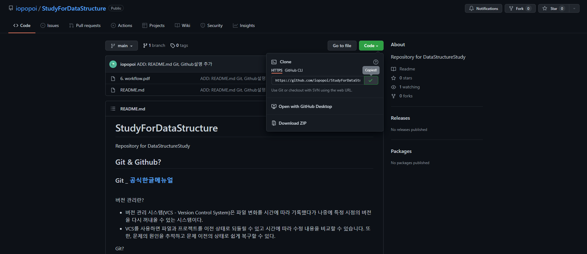

# StudyForDataStructure
Repository for DataStructureStudy
## Study
- [Part1. STL, vector, sort](https://abrupt-pancake-3c6.notion.site/C-STL-85ae6658dc0a433eb2db902752894ee6)
- [Part2. Stack & Queue](https://abrupt-pancake-3c6.notion.site/stack-queue-109b7affba8e443c906c353edc6a8bab)
- [Part3. Flood Fill](https://abrupt-pancake-3c6.notion.site/flood-fill-9fbd301454424989a300701c51c33447)
- [Part4. Graph](https://abrupt-pancake-3c6.notion.site/Graph-150a376d0a3042d8bd47807cbe552222)
## How to use this Repo
1. 각자 자신의 branch를 만들어 작업하고 작업한 내용을 자신의 branch에 push한다.
2. 자신의 branch의 내용을 main branch에 포함시키기 위한 pull request를 작성한다(요청한다). 
3. Save and Share code
    - "name_BOJ ID"폴더를 만들고 그 안에 각 주차 폴더를 만든다.
    - 폴더 안에 파일을 만들고 작업한다.
    - 작업 후에 자신의 branch에 push하여 공유한다.
    - pull request를 작성한다(요청한다).
        - main <- my branch
        - 이름, 문제 번호. 문제이름(, 문제 풀이 설명 등)을 포함하여 작성합니다.
4. 질문은 issue를 이용한다. 
    - 원하는 tag가 있는지 확인하고 원하는 tag가 없으면 직접 만들어주세요.
<br><br>

## Git & Github?
### Git  _  [공식한글메뉴얼](https://git-scm.com/book/ko/v2)
<br>

버전 관리란?
- 버전 관리 시스템(VCS - Version Control System)은 파일 변화를 시간에 따라 기록했다가 나중에 특정 시점의 버전을 다시 꺼내올 수 있는 시스템이다.
- VCS를 사용하면 파일과 프로젝트를 이전 상태로 되돌릴 수 있고 시간에 따라 수정 내용을 비교할 수 있습니다. 또한, 문제의 원인을 추적하고 문제 이전의 상태로 쉽게 복구할 수 있다.

Git?
- 형상 관리 도구(버전 관리 시스템) 중 하나로 소스코드를 효과적으로 관리하게 해주는 무료, 공개 소프트웨어이다.
- 분산형 관리 시스템으로 소스 코드를 여러 개발 PC와 저장소에 분산하여 저장한다. <br>
- 소스코드를 주고 받을 필요 없이, 같은 파일을 여러 명이 동시에 작업하는 병렬 개발이 가능하다. branch를 통해 개발한 뒤, 본 프로그램에 Merge(합치는) 방식으로 작업을 진행할 수 있다.

Github?
- 형상 관리 도구(버전 관리) 웹호스팅 서비스로 협업하고 있는 코드를 저장할 서버
- 버전 관리 시스템을 지원하는 서비스로 push, pull request등 을 통해 작업을 할 수 있다.

용어들...
- Repository: 저장소, branch에 따라 소스코드, 히스토리를 저장한다. 
- Commit
- Branch: 가지 또는 분기점, 작업을 할때, 현재 상태를 복사하여 Branch에서 작업한다. 작업과 검증을 완전히 마친 후에 Merge하여 작업을 한다. 
- Merge: 다른 Branch의 내용을 현재 Branch로 가져와 합치는 작업을 의미한다.
<br><br>

## Install Git & set Github
1. [install Git](http://git-scm.com/download/win) 

2. 사용자 이름/ 이메일 등록
    ```
    git config --global user.name "user_name"
    git config --global user.email "your_email@example.com"

    git config --list
    ```

3. [Github 가입하기](https://github.com/)

4. git bash 실행 및 ssh키 생성하기_[참고자료](https://www.lainyzine.com/ko/article/creating-ssh-key-for-github/)
    ```
    $ cd ~/.ssh
    $ ls
    ```
    ls를 통해 id_ed25519와 id_ed25519.pub 또는 id_rsa와 id_rsa.pub 파일 쌍이 있는지 확인한다.
    이 파일이 없는 경우
    ```
    $ ssh-keygen -t ed25519 -C "your_email@example.com"
    ```
    위의 명령어를 통해 ssh키를 생성한다. 저장위치와 ssh키의 비밀번호 설정을 물으면 원하는 설정을 해줍니다. (편한건 default, 그냥 "enter"를 눌러주면 됩니다.)
    ```
    cat id_rsa.pub
    ```
    위의 명령어를 통해 key를 확인하고 결과를 모두 복사한다.<br>

5. Github에 ssh키를 등록한다.
    - Github 로그인 후 오른쪽 상당의 프로필을 클릭하소, Setting 메뉴로 이동한다.
    - 사이드 바에서 SSH and GPU keys 메뉴를 선택하고 New SSH key를 클릭한다.
    - Title: 등록하여는 키의 이름, 본인이 구분하기 편하도록 이름을 정한다.
    - Key: 앞서 복사한 키를 입력한다.
    - Add SSH key
    

## How to use Git & Github

- Clone Repository
    1. 원하는 Repository를 clone받기 해당 Repo의 clone code를 복사한다.
        
    2. terminal에서 clone 받고 싶은 위치로 이동한다.

        ``` 
        git clone https://github.com/iopopoi/StudyForDataStructure.git
        ```
        위의 명령여를 통해 Repo를 clone하면 clone받은 위치에 폴더가 생기는 것을 볼 수 있다.


- git 생성하기
    ```
    $ git init
    ```
- 연결된 저장소의 내용 불러오기
    ```
    $ git pull
    $ git pull origin
    $ git pull <branch name>
    $ git pull origin <branch name>
    ```
- 수정한 코드 확인하기 
    ```
    $ git status
    ```
- 수정한 코드 선택하기
    ```
    $ git add <file명, 확장자명, 파일경로> 
    $ git add ./ #수정된 모든 파일을 선택한다.
    ```
- 선택한 코드의 설명을 적는다.
    ```
    $ git commit -m <설명>
    ```
- add하고 commit 한 코드를 git server에 보낸다. [ 로컬 Repo -> 원격 Repo ]
    ```
    $ git push origin <브랜치명>
    $ git push origin master
    $ git push
    ```
- commit 내역 확인
    ```
    $ git log
    $ git log --pretty=oneline # 한줄로 표기하기
    ```
-  [local](https://gitabout.com/8#:~:text=%EA%B0%88%20%EC%88%98%20%EC%9E%88%EC%8A%B5%EB%8B%88%EB%8B%A4.%C2%A0-,Git%20reset,-Git%20reset%20%EB%AA%85%EB%A0%B9%EC%96%B4%EB%8A%94) 원하는 지점으로 되돌리기
    ```
    $ git log # 되돌리고 싶은 위치의 commit hash를 확인한다.
    $ git reset <option> <commit hash>
    $ git reset <commit hash>
    $ git reset --soft <commit hash> # commit 이력은 삭제하지만 추가된 파일이 삭제되지 않는다.
    $ git reset --hard <commit hash> # 과거에 발생한 모든 수정사항을 깔끔하게 지운다. 변경 사항을 유지할 필요하 없을 때 이용한다.
    ```
- [원격 저장소](https://gitabout.com/8#:~:text=Git-,revert,-%EC%BB%A4%EB%B0%8B%20%EC%9D%B4%EB%A0%A5%EC%9D%84%20%EA%B3%BC%EA%B1%B0%EB%A1%9C) 원하는 지점으로 복구하여 새로운 commit 생성
    ```
    $ git revert <commit hash>
    ```
- reset vs revert
    - reset은 작업을 단순하게 해주는 장점이 있지만 이미 원격 저장소에  push된 commit은 reset으로 되도리면 안된다.
    - 원격 저장소와 싱크라 맞지 않아 commit 을 push할 수 없다.<
    - 이와 달리 revert는 commit history를 수정하지 않고 새로운 commit을 -생성하기 때문에 원격 저장소에 push된 commit도 수정이 가능하다.

## How to use Branch
- brahch 목록 확인하기
    ```
    $ git branch -v
    ```
- branch생성하기
    ```
    $ git branch <branch 명>
    ```
- 원하는 branch로 이동
    ```
    $ git checkout <branch명>
    $ git checkout -b <branch명> #branch를 생성하고 해당 branch로 이동한다.
- branch 삭제하기
    ```
    $ git branch -d <branch 명>
    ```
- branch 병합하기
    ```
    $ git branch merge <branch 명> # 병합시킬 branch의 상위 branch애서 merge하여 두 branch를 병합한다.
    ```

### 참고자료
- [[Git] git 명령어 모음, 총 정리 (gitbash, terminal)](https://gorokke.tistory.com/22)
